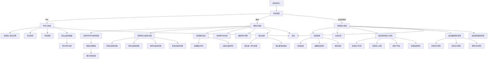

# 地獄部隊點名系統專案

## 專案概述
本專案旨在開發一個地獄部隊點名系統網站，供地獄部隊使用，採用HTML、CSS和JavaScript，提供簡單易用的前端體驗。系統支援學生、教師和管理者三種角色，提供個人點名狀態查看、報導提交、出缺席紀錄管理、請假申請與審核、罰寫繳交登記以及成員和系統管理等功能，介面直觀，適合快速部署和使用。

## 架構流程圖
以下是地獄部隊點名系統的架構流程圖，使用Mermaid表示，反映各角色的功能：



## 流程說明
1. **使用者登入**：支援帳號密碼登入，直接進入角色選擇。
2. **角色選擇**：根據使用者角色（學生、教師、管理者）導向對應主頁面。
3. **學生主頁面**：
   - 查看個人點名狀態。
   - 提交報導。
   - 申請請假。
   - 對出缺席記錄提出疑慮，標注特定日期。
4. **教師主頁面**：
   - 查詢所有學生的留校紀錄，支援日期範圍篩選。
   - 管理學生出缺席紀錄（新增、修改、刪除、查詢）。
   - 罰寫繳交登記：記錄當天繳交罰寫的學生（通過/未通過）。
   - 新增學生到名單。
   - 審核學生請假申請。
   - 匯出紀錄：支援單一學生或整張紀錄表（Excel/PDF）。
5. **系統管理者主頁面**：
   - 管理成員（新增、編輯、刪除）。
   - 調整系統設定。
   - 查詢所有使用者登入詳情（時間、位置、IP、裝置）。
   - 最高權限管理：新增、修改、刪除任何資料（包括學生和紀錄）。
   - 查看請假申請的審核狀態及結果。
6. **登出**：所有角色可從主頁面登出。

## 專案結構
專案採用簡單的HTML、CSS和JavaScript結構，包含以下主要文件：
- **/roll-call-system**：專案根目錄
  - **/login.html**：登入頁面
  - **/student-dashboard.html**：學生主頁面
  - **/teacher-dashboard.html**：教師主頁面
  - **/admin-dashboard.html**：管理者主頁面
  - **/index.html**：首頁（導向登入頁面）
- **/public**：靜態資源
  - **/fonts**：字型檔案
  - **/images**：圖片檔案
- **/README.md**：專案說明文件

## 功能模組與檔案對應
以下是每個功能的具體實現檔案：
- **使用者認證**：
  - **登入**：/roll-call-system/login.html
- **學生功能**：
  - **學生主頁面**：/roll-call-system/student-dashboard.html
  - **查看個人點名狀態**：/roll-call-system/student-dashboard.html
  - **提交報導**：/roll-call-system/student-dashboard.html
  - **申請請假**：/roll-call-system/student-dashboard.html
  - **提出出缺席疑慮**：/roll-call-system/student-dashboard.html
- **教師功能**：
  - **教師主頁面**：/roll-call-system/teacher-dashboard.html
  - **查詢所有學生留校紀錄**：/roll-call-system/teacher-dashboard.html
  - **管理學生出缺席紀錄**：/roll-call-system/teacher-dashboard.html
  - **罰寫繳交登記**：/roll-call-system/teacher-dashboard.html
  - **新增學生到名單**：/roll-call-system/teacher-dashboard.html
  - **審核學生請假**：/roll-call-system/teacher-dashboard.html
  - **匯出紀錄**：/roll-call-system/teacher-dashboard.html
- **管理者功能**：
  - **管理者主頁面**：/roll-call-system/admin-dashboard.html
  - **成員管理**：/roll-call-system/admin-dashboard.html
  - **系統設定**：/roll-call-system/admin-dashboard.html
  - **查詢使用者登入詳情**：/roll-call-system/admin-dashboard.html
  - **最高權限資料管理**：/roll-call-system/admin-dashboard.html
  - **查看請假審核狀態**：/roll-call-system/admin-dashboard.html

## 技術棧
- **前端**：HTML, CSS, JavaScript
- **樣式**：自定義CSS，結合Google Fonts和Font Awesome圖標

## 環境設定
### 前置條件
- 任何現代網頁瀏覽器（如Chrome、Firefox）

### 安裝步驟
1. **複製專案**：
   ```
   git clone <repository-url>
   cd roll-call-system
   ```
2. **開啟頁面**：
   - 直接在瀏覽器中開啟 `/roll-call-system/index.html` 文件，或通過本地伺服器（如Live Server）運行。

## 功能需求
1. **使用者認證**：
   - 支援帳號密碼登入。
   - 三種角色：學生、教師、管理者，各自擁有不同權限。
2. **學生功能**：
   - 查看個人點名狀態。
   - 提交報導。
   - 申請請假。
   - 提出出缺席疑慮。
3. **教師功能**：
   - 查詢所有學生留校紀錄（按日期範圍篩選）。
   - 管理學生出缺席紀錄（新增、修改、刪除、查詢）。
   - 罰寫繳交登記：記錄當天繳交罰寫的學生（通過/未通過）。
   - 新增學生到名單。
   - 審核學生請假申請。
   - 匯出紀錄：支援單一學生或整張紀錄表（Excel/PDF）。
4. **管理者功能**：
   - 管理成員（新增、編輯、刪除）。
   - 調整系統設定。
   - 查詢所有使用者登入詳情（時間、位置、IP、裝置）。
   - 最高權限管理：新增、修改、刪除任何資料（學生、紀錄等）。
   - 查看請假申請的審核狀態及結果。

## 未來擴展
- 支援多語言介面。
- 整合後端資料庫以實現真實資料存儲和管理。
- 開發移動端適配版本，提升使用體驗。

## 結語
本專案以簡單的HTML、CSS和JavaScript為核心，打造一個易於使用的地獄部隊點名系統網站，專注於出缺席管理、罰寫繳交登記、請假審核等功能。專案結構清晰，適合快速部署和進一步擴展。後續將根據實際需求持續優化。
