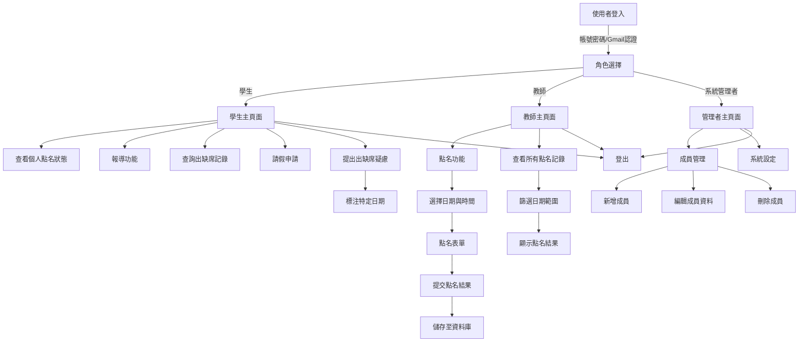

# 點名系統網站專案

## 專案概述
本專案旨在開發一個點名系統網站，供地獄部隊使用，採用Remix框架，結合React和Tailwind CSS，提供高效能的前端體驗和簡潔的樣式設計。系統支援學生、教師和系統管理者三種角色，提供點名、記錄查詢、成員管理和通知等功能，介面簡單易用，後端具備可擴展性。

## 架構流程圖
以下是點名系統網站的架構流程圖，使用Mermaid表示：



## 流程說明
1. **使用者登入**：支援帳號密碼或Gmail認證登入。
2. **角色選擇**：根據使用者角色（學生、教師、管理者）導向對應主頁面。
3. **學生主頁面**：
   - 查看個人點名狀態。
   - 提交報導。
   - 查詢出缺席記錄。
   - 申請請假。
   - 對出缺席記錄提出疑慮，標注特定日期。
4. **教師主頁面**：
   - 執行點名，選擇日期和時間，提交點名表單。
   - 查看所有點名記錄，支援日期範圍篩選。
5. **系統管理者主頁面**：
   - 管理成員（新增、編輯、刪除）。
   - 調整系統設定。
6. **登出**：所有角色可從主頁面登出。

## 專案結構
專案採用Remix框架的標準結構，整合Tailwind CSS進行樣式設計，並為每個功能指定明確的檔案名稱：
- **/roll-call-system**：專案根目錄
  - **/app**：應用程式核心程式碼
    - **/routes**：Remix路由檔案，定義頁面和API端點
      - **/index.tsx**：首頁（導向登入頁面）
      - **/login.tsx**：登入頁面
      - **/logout.tsx**：登出功能
      - **/student**：學生相關路由
        - **/dashboard.tsx**：學生主頁面
        - **/check-in.tsx**：學生報到點名功能
        - **/attendance-record.tsx**：學生查詢出缺席記錄
        - **/leave-request.tsx**：學生請假申請
        - **/attendance-dispute.tsx**：學生提出出缺席疑慮
      - **/teacher**：教師相關路由
        - **/dashboard.tsx**：教師主頁面
        - **/roll-call.tsx**：教師點名功能
        - **/all-records.tsx**：教師查看所有點名記錄
      - **/admin**：管理者相關路由
        - **/dashboard.tsx**：管理者主頁面
        - **/member-management.tsx**：成員管理（新增、編輯、刪除）
        - **/system-settings.tsx**：系統設定
        - **/login-records.tsx**：查詢所有使用者登入記錄
    - **/components**：可重用的React組件
      - **/Header.tsx**：頁面標頭組件
      - **/Sidebar.tsx**：側邊欄導航組件
      - **/RollCallForm.tsx**：點名表單組件
      - **/AttendanceTable.tsx**：點名記錄表格組件
      - **/LeaveForm.tsx**：請假申請表單組件
      - **/DisputeForm.tsx**：出缺席疑慮表單組件
      - **/MemberForm.tsx**：成員管理表單組件
    - **/styles**：樣式檔案
      - **/tailwind.css**：Tailwind CSS主檔案
      - **/global.css**：全域樣式
    - **/utils**：工具函數
      - **/auth.ts**：使用者認證（帳號密碼和JWT處理）
      - **/gmail-auth.ts**：Gmail認證處理
      - **/api.ts**：API請求工具
      - **/date-utils.ts**：日期和時間處理工具
    - **/models**：資料模型
      - **/user.ts**：使用者模型
      - **/attendance.ts**：點名記錄模型
      - **/leave.ts**：請假記錄模型
      - **/dispute.ts**：出缺席疑慮模型
    - **/root.tsx**：應用程式根組件
    - **/entry.server.tsx**：伺服器端入口
    - **/entry.client.tsx**：客戶端入口
  - **/public**：靜態資源
    - **/images**：圖片檔案
    - **/fonts**：字型檔案
  - **/prisma**：Prisma ORM設定（用於MongoDB）
    - **/schema.prisma**：資料庫結構定義
  - **/.env**：環境變數檔案
  - **/package.json**：專案依賴和腳本
  - **/remix.config.js**：Remix設定
  - **/tailwind.config.js**：Tailwind CSS設定
  - **/tsconfig.json**：TypeScript設定
  - **/Dockerfile**：Docker部署設定
- **/docs**：文件資料
- **/tests**：測試檔案
  - **/unit**：單元測試
  - **/integration**：整合測試

## 功能模組與檔案對應
以下是每個功能的具體實現檔案：
- **使用者認證**：
  - **登入**：/app/routes/login.tsx, /app/utils/auth.ts, /app/utils/gmail-auth.ts
  - **登出**：/app/routes/logout.tsx
  - **角色選擇**：/app/utils/auth.ts（後端邏輯）, /app/routes/index.tsx（導航邏輯）
- **學生功能**：
  - **學生主頁面**：/app/routes/student/dashboard.tsx
  - **報到點名**：/app/routes/student/check-in.tsx, /app/components/RollCallForm.tsx
  - **查詢出缺席記錄**：/app/routes/student/attendance-record.tsx, /app/components/AttendanceTable.tsx
  - **請假申請**：/app/routes/student/leave-request.tsx, /app/components/LeaveForm.tsx
  - **提出出缺席疑慮**：/app/routes/student/attendance-dispute.tsx, /app/components/DisputeForm.tsx
- **教師功能**：
  - **教師主頁面**：/app/routes/teacher/dashboard.tsx
  - **點名功能**：/app/routes/teacher/roll-call.tsx, /app/components/RollCallForm.tsx
  - **查看所有點名記錄**：/app/routes/teacher/all-records.tsx, /app/components/AttendanceTable.tsx
- **管理者功能**：
  - **管理者主頁面**：/app/routes/admin/dashboard.tsx
  - **成員管理**：/app/routes/admin/member-management.tsx, /app/components/MemberForm.tsx
  - **系統設定**：/app/routes/admin/system-settings.tsx
  - **查詢登入記錄**：/app/routes/admin/login-records.tsx
- **通知系統**：
  - **實現**：/app/utils/api.ts（發送Email或即時訊息）
- **記錄查詢與匯出**：
  - **查詢**：/app/routes/teacher/all-records.tsx, /app/routes/student/attendance-record.tsx
  - **匯出**：/app/utils/api.ts（處理Excel/PDF匯出）

## 技術棧
- **前端**：Remix (React), Tailwind CSS, TypeScript
- **後端**：Remix (內建伺服器), Node.js
- **資料庫**：MongoDB（透過Prisma ORM）
- **認證**：JWT (JSON Web Tokens), Google OAuth (Gmail認證)
- **部署**：Docker, AWS
- **其他工具**：Prisma (ORM), Remix Auth (認證管理)

## 環境設定
### 前置條件
- Node.js (v18 或以上)
- MongoDB (本地或雲端)
- npm 或 yarn
- Google Cloud Console（用於Gmail認證）

### 安裝步驟
1. **複製專案**：
   ```
   git clone <repository-url>
   cd roll-call-system
   ```
2. **安裝依賴**：
   ```
   npm install
   ```
3. **設定環境變數**：
   - 建立 .env 檔案，加入以下內容：
     ```
     DATABASE_URL="mongodb://<host>:<port>/<database>"
     JWT_SECRET="<your-jwt-secret>"
     GOOGLE_CLIENT_ID="<your-google-client-id>"
     GOOGLE_CLIENT_SECRET="<your-google-client-secret>"
     SESSION_SECRET="<your-session-secret>"
     ```
4. **初始化Prisma**：
   ```
   npx prisma init
   npx prisma generate
   ```
5. **初始化Tailwind CSS**：
   - 確保 tailwind.config.js 已配置，運行：
     ```
     npx tailwindcss -i ./app/styles/tailwind.css -o ./app/styles/output.css --watch
     ```
6. **啟動開發伺服器**：
   ```
   npm run dev
   ```
7. **建置與部署**：
   ```
   npm run build
   npm start
   ```

### Docker部署
1. **建置Docker映像**：
   ```
   docker build -t roll-call-system .
   ```
2. **運行容器**：
   ```
   docker run -p 3000:3000 --env-file .env roll-call-system
   ```

## 功能需求
1. **使用者認證**：
   - 支援帳號密碼和Gmail認證。
   - 三種角色：學生、教師、管理者，各自擁有不同權限。
   - Gmail認證實現快速登入。
2. **點名管理**：
   - 支援每日多時段點名。
   - 自動生成點名表單，教師可手動調整。
   - 學生僅查看個人狀態，教師和管理者可操作點名。
3. **成員管理**：
   - 支援批量匯入成員（CSV格式）。
   - 支援分組管理。
   - 管理者可新增、編輯、刪除成員。
4. **記錄查詢**：
   - 支援多條件查詢（日期、成員、狀態）。
   - 支援匯出Excel或PDF。
   - 學生僅查看個人記錄，教師和管理者可查看全部。
5. **通知系統**：
   - 點名完成後自動通知（Email或即時訊息）。
   - 支援管理者自訂通知設定。

## 未來擴展
- 支援多語言介面（i18n）。
- 整合即時通訊（WebSocket）。
- 開發移動端App，支援離線點名。

## 結語
本專案以Remix框架為核心，結合React、Tailwind CSS和MongoDB，打造一個高效、易用的點名系統網站。專案結構清晰，功能模組化，適合長期維護和擴展。後續將根據實際需求持續優化。
