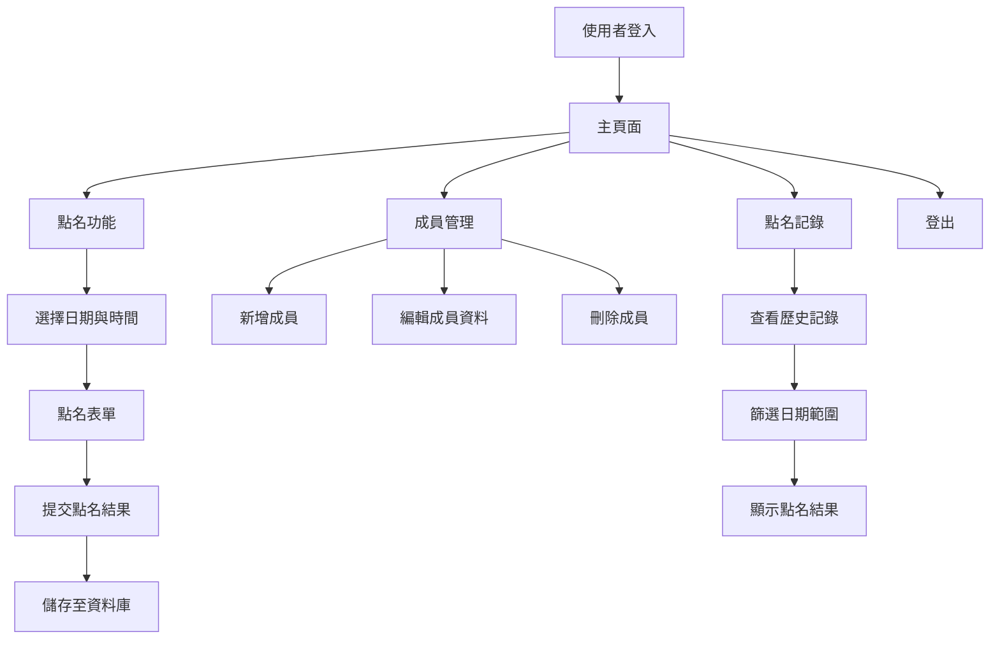

# 點名系統網站架構規劃

## 專案概述
本專案旨在開發一個點名系統網站，供地獄部隊使用。該系統將提供一個簡單易用的介面，讓使用者能夠快速進行點名、查看點名記錄以及管理成員資料。

## 架構流程圖
以下是點名系統網站的架構流程圖，使用Mermaid表示：

### 流程說明
1. **使用者登入**：使用者需要輸入帳號和密碼以進入系統。
2. **主頁面**：登入後進入主頁面，可選擇點名功能、成員管理或查看點名記錄。
3. **點名功能**：
   - 選擇日期與時間。
   - 填寫點名表單，標記成員出席狀況。
   - 提交結果並儲存至資料庫。
4. **成員管理**：
   - 新增、編輯或刪除成員資料。
5. **點名記錄**：
   - 查看歷史點名記錄。
   - 可依日期範圍篩選結果。
6. **登出**：使用者可從主頁面登出系統。

## 專案結構規劃
專案將採用以下目錄結構，方便管理和開發：

- **/src**：存放原始碼
  - **/components**：React組件
  - **/pages**：頁面檔案
  - **/styles**：CSS樣式檔案
  - **/utils**：工具函數
  - **/api**：後端API接口
- **/public**：靜態資源
  - **/images**：圖片檔案
  - **/fonts**：字型檔案
- **/docs**：文件資料
- **/tests**：測試檔案

## 技術棧
- **前端**：React.js, Redux, CSS Modules
- **後端**：Node.js, Express
- **資料庫**：MongoDB
- **認證**：JWT (JSON Web Tokens)
- **部署**：Docker, AWS

## 功能需求
1. **使用者認證**：支援帳號密碼登入，未來可擴展至第三方認證。
   - 支援三種使用者角色：學生、教師和管理者。
   - 不同角色擁有不同的權限和功能。
2. **點名管理**：
   - 每日點名功能，支援多時段點名。
   - 自動生成點名表單，支援手動調整。
   - 教師和管理者可進行點名操作，學生僅能查看自己的點名狀態。
3. **成員管理**：
   - 支援批量匯入成員資料。
   - 支援成員分組管理。
   - 管理者可新增、編輯和刪除成員資料。
4. **記錄查詢**：
   - 支援按日期、成員、狀態等多條件查詢。
   - 支援匯出點名記錄為Excel或PDF格式。
   - 學生僅能查看自己的記錄，教師和管理者可查看所有記錄。
5. **通知系統**：
   - 點名完成後自動通知相關人員。
   - 支援Email或即時訊息通知。

## 未來擴展
- 支援多語言介面。
- 整合即時通訊功能，方便成員間溝通。
- 開發移動端App，支援離線點名功能。

## 結語
本專案將以使用者體驗為核心，打造一個高效、易用的點名系統網站。後續將根據實際需求進行功能調整與優化。
