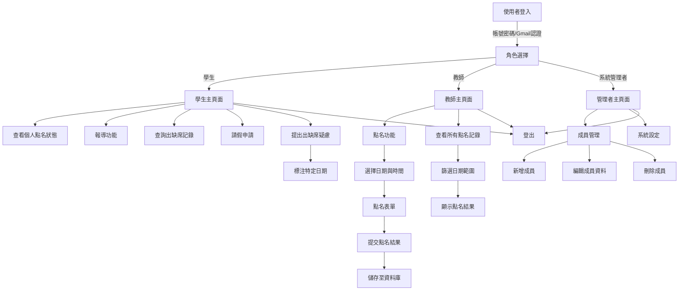

# 點名系統網站架構規劃

## 專案概述
本專案旨在開發一個點名系統網站，供地獄部隊使用。該系統將提供一個簡單易用的介面，讓使用者能夠快速進行點名、查看點名記錄以及管理成員資料。

## 架構流程圖
以下是點名系統網站的架構流程圖，使用Mermaid表示：

### 流程說明
1. **使用者登入**：使用者可透過帳號密碼或Gmail認證登入系統。
2. **角色選擇**：登入後，系統會根據使用者角色導向不同的主頁面。
3. **學生主頁面**：
   - 查看個人點名狀態。
   - 報導功能：學生可提交相關報導。
   - 查詢出缺席記錄：學生可查看自己的出缺席歷史記錄。
   - 請假申請：學生可提交請假申請。
   - 提出出缺席疑慮：學生可對特定日期的出缺席狀態提出疑慮或申訴。
4. **教師主頁面**：
   - 可進行點名功能，選擇日期與時間，填寫點名表單並提交結果。
   - 可查看所有點名記錄，並按日期範圍篩選。
5. **系統管理者主頁面**：
   - 可進行成員管理，包括新增、編輯和刪除成員資料。
   - 可進行系統設定，調整系統參數。
6. **登出**：所有角色均可從各自的主頁面登出系統。

## 專案結構規劃
專案將採用React框架的標準目錄結構，方便管理和開發：

- **/roll-call-system**：專案根目錄
  - **/src**：存放原始碼
    - **/components**：React組件
    - **/pages**：頁面檔案
    - **/styles**：CSS樣式檔案
    - **/utils**：工具函數
    - **/api**：後端API接口
  - **/public**：靜態資源
    - **/images**：圖片檔案
    - **/fonts**：字型檔案
  - **/package.json**：專案依賴和腳本
  - **/index.js**：應用程式入口點
  - **/App.js**：主要應用程式組件
- **/docs**：文件資料
- **/tests**：測試檔案

## 技術棧
- **前端**：React.js, Redux, CSS Modules
- **後端**：Node.js, Express
- **資料庫**：MongoDB
- **認證**：JWT (JSON Web Tokens)
- **部署**：Docker, AWS

## 功能需求
1. **使用者認證**：支援帳號密碼登入，並整合Gmail認證作為第三方認證方式。
   - 支援三種使用者角色：學生、教師和管理者。
   - 不同角色擁有不同的權限和功能。
   - 使用Gmail認證可快速登入系統，無需額外註冊。
2. **點名管理**：
   - 每日點名功能，支援多時段點名。
   - 自動生成點名表單，支援手動調整。
   - 教師和管理者可進行點名操作，學生僅能查看自己的點名狀態。
3. **成員管理**：
   - 支援批量匯入成員資料。
   - 支援成員分組管理。
   - 管理者可新增、編輯和刪除成員資料。
4. **記錄查詢**：
   - 支援按日期、成員、狀態等多條件查詢。
   - 支援匯出點名記錄為Excel或PDF格式。
   - 學生僅能查看自己的記錄，教師和管理者可查看所有記錄。
5. **通知系統**：
   - 點名完成後自動通知相關人員。
   - 支援Email或即時訊息通知。

## 未來擴展
- 支援多語言介面。
- 整合即時通訊功能，方便成員間溝通。
- 開發移動端App，支援離線點名功能。

## 結語
本專案將以使用者體驗為核心，打造一個高效、易用的點名系統網站。後續將根據實際需求進行功能調整與優化。
